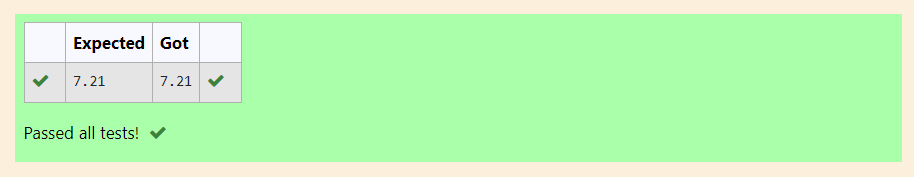

# DISTANCE-BETWEEN-TWO-POINTS

## AIM:
To write a python program to find the distance between 2 points
## ALGORITHM:
### Step 1: 
Assign the value of First point.

### Step 2:
Assign the value of Second point. 

### Step 3: 
Substitute the values in the distance formula  

### Step 4: 
Print the Result upto 2 Decimals.

### Step 5: 
End the Program.

### PROGRAM:
```
#Program to find the distance between two points.
#Developed by: Rithiga Sri.B
#RegisterNumber:21500732

import math
l1=[10,6]
l2=[4,2]
value=math.sqrt(((l1[0]-l2[0])**2)-((l1[1]-l2[1])**2))
print("{:.2f}".format(value))
```
  
### OUTPUT:



### RESULT:
Thus the distance between two points is successfully found.
